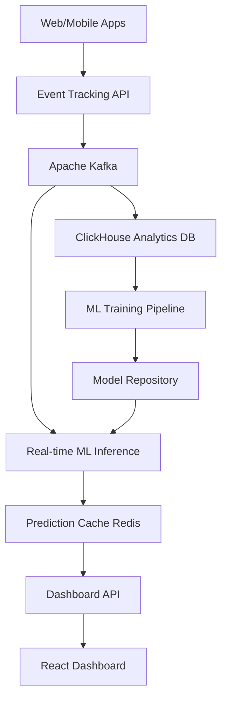
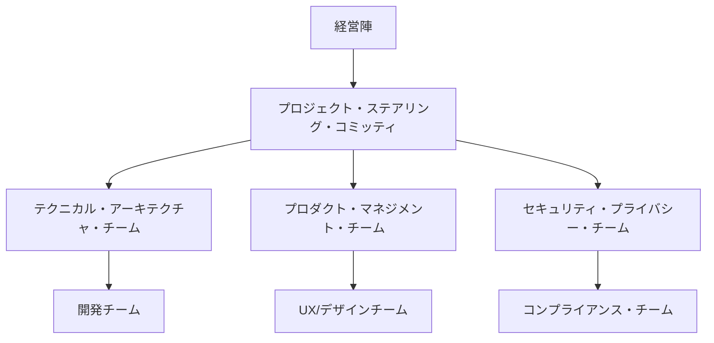

# 🚀 AI分析システム売上最適化エンジン変革プロジェクト
## 包括的開発計画書

### 📊 **プロジェクト概要**
現在のAI分析システムを、売上向上に特化した次世代Revenue Intelligence Platformに変革するための統合開発計画

**開発期間**: 8ヶ月（4フェーズ）  
**投資額**: ¥187,500,000（$1,250,000）  
**期待ROI**: 300-500%（12-14ヶ月）  
**売上向上目標**: 25-40%（Phase 4完了時）

---

## 🎯 **戦略的目標**

### ビジネス目標
- Google Analytics/Adobe Analyticsを技術的に凌駕
- AI-First収益最適化プラットフォームの市場リーダーシップ確立
- 中小企業から大企業まで対応する差別化されたソリューション提供
- **ワンクリック・ワンタップで誰でも使えるシンプルUI**

### 技術目標
- リアルタイム購入予測（85%精度、50ms以下レスポンス）
- 動的価格・オファー最適化の自動化
- クロスデバイス顧客行動統合分析
- AI主導のカスタマージャーニー最適化
- **複雑なAI機能を「魔法のボタン」として実装**

### UI/UX目標
- **ワンクリック・ワンタップ操作**: すべての主要機能を1回のクリックで実行
- **ゼロ学習コスト**: 説明書不要の直感的インターフェース
- **3秒ルール**: どんな分析も3秒以内に結果表示
- **自動提案**: ユーザーが考える前にAIが最適解を提示

---

## 📅 **開発フェーズ詳細**

## Phase 1: Foundation - 基盤構築とシンプルUI（Month 1-2）
**予算**: ¥37,500,000（$250,000）  
**チーム**: 10名（ML Engineer 2名、Backend Engineer 3名、Frontend Engineer 2名、UX Designer 1名、Data Scientist 1名、DevOps Engineer 1名）

### 🔥 **優先機能**
1. **ワンクリックダッシュボード**
   - 「売上診断」ボタン：即座に改善提案表示
   - 「顧客理解」ボタン：顧客インサイト自動生成
   - 「最適化実行」ボタン：AIによる自動最適化開始
   - モバイルファーストの直感的UI

2. **リアルタイム購入予測システム**
   - 基本ML予測モデル（初期精度60-70%）
   - ユーザー行動スコアリング
   - 購入確率リアルタイム表示
   - **結果は「買いそう度」として%表示**

3. **顧客価値スコアリング**
   - CLV（Customer Lifetime Value）予測
   - 高価値顧客自動識別
   - セグメント別最適化
   - **「大切なお客様」として分かりやすく表示**

4. **強化された行動追跡**
   - スクロール深度、クリックパターン
   - フォーム離脱分析
   - **「お客様が困っている場所」として可視化**
   - マイクロインタラクション追跡

### 🎯 **UXシンプル化実装**
1. **魔法のボタン v1.0**
   - 「売上を上げる」ワンクリックボタン
   - 「問題を見つける」自動診断ボタン
   - シンプルな3指標ダッシュボード

2. **プログレッシブUI**
   - 初心者モード（ボタン3つのみ）
   - 詳細モード（オプション）
   - 専門用語の排除

### 📈 **期待成果**
- 売上向上: 5-10%
- 顧客10社のパイロットプログラム開始
- 基本ROI実証

### 🔧 **技術実装**

```typescript
// 購入予測エンジン
interface PurchasePredictionEngine {
  userId: string;
  sessionData: SessionBehavior;
  purchaseProbability: number;    // 0-100%
  recommendedActions: Action[];
  timeToConvert: number;         // 分単位
  predictedValue: number;        // 円
}

// 顧客価値スコアリング
interface CustomerValueScore {
  customerId: string;
  currentValue: number;
  predictedLTV: number;
  churnRisk: number;            // 0-100%
  segment: 'high' | 'medium' | 'low';
  nextBestAction: Action;
}
```

---

## Phase 2: Enhancement - 機能拡張（Month 3-4）
**予算**: ¥60,000,000（$400,000）  
**チーム**: 11名（上記 + UX Engineer 1名、Marketing Engineer 1名）

### 🚀 **追加機能**
1. **動的価格・オファー最適化**
   - リアルタイム価格調整アルゴリズム
   - A/Bテスト自動化
   - 在庫・需要連動価格設定

2. **収益アトリビューション分析**
   - マルチタッチアトリビューションモデル
   - チャネル別ROI測定
   - キャンペーン効果測定

3. **カスタマーアクイジション最適化**
   - チャネル別CAC最適化
   - 予算配分自動調整
   - 高価値見込み客特定

### 📈 **期待成果**
- 売上向上: 15-20%
- 顧客50社まで拡大
- チャネル別ROI最適化実現

### 🔧 **技術実装**

```typescript
// 動的価格最適化
interface DynamicPricingEngine {
  productId: string;
  basePrice: number;
  optimizedPrice: number;
  priceElasticity: number;
  competitorPrices: CompetitorPrice[];
  demandForecast: number;
  inventoryLevel: number;
  expectedLift: number;
}

// アトリビューション分析
interface AttributionAnalysis {
  customerId: string;
  touchpoints: Touchpoint[];
  conversionPath: string[];
  channelContribution: ChannelContribution[];
  totalROI: number;
  optimizationRecommendations: string[];
}
```

---

## Phase 3: Intelligence - AI知能化（Month 5-6）
**予算**: ¥75,000,000（$500,000）  
**チーム**: 13名（上記 + Privacy Engineer 1名、専任QA Engineer 1名）

### 🧠 **AI機能強化**
1. **AI主導カスタマージャーニー最適化**
   - 個別化された顧客体験パス
   - リアルタイム体験調整
   - 感情分析による離脱防止

2. **予測パーソナライゼーション**
   - ユーザー個別コンテンツ最適化
   - 最適タイミング配信
   - 行動予測による先回り提案

3. **チャーン防止システム**
   - 離脱リスク早期検知
   - 自動リテンション施策
   - ライフタイムバリュー保護

### 📈 **期待成果**
- 売上向上: 20-30%
- 顧客200社達成
- プラットフォーム収益化開始

### 🔧 **技術実装**

```typescript
// カスタマージャーニー最適化
interface JourneyOptimizer {
  userId: string;
  currentStage: JourneyStage;
  optimalNextSteps: NextStepRecommendation[];
  personalizedContent: Content[];
  emotionalState: EmotionalAnalysis;
  interventionTriggers: InterventionTrigger[];
}

// チャーン防止システム
interface ChurnPrevention {
  customerId: string;
  churnProbability: number;      // 0-100%
  riskFactors: RiskFactor[];
  interventionStrategy: InterventionStrategy;
  expectedRetentionLift: number;
  recommendedOffers: RetentionOffer[];
}
```

---

## Phase 4: Excellence - 市場優位性確立（Month 7-8）
**予算**: ¥75,000,000（$500,000）  
**チーム**: 15名（上記 + Enterprise Sales Engineer 1名、Customer Success Manager 1名）

### 🏆 **プレミアム機能**
1. **完全統合型収益インテリジェンス**
   - 全チャネルデータ統合
   - 予測モデル精度95%+達成
   - 自動化された意思決定支援

2. **業界特化型AIモデル**
   - ECサイト、企業サイト等業態別最適化
   - 競合分析・ベンチマーク
   - 業界トレンド予測

3. **エンタープライズ機能**
   - マルチテナント対応
   - 高度なセキュリティ・コンプライアンス
   - カスタムダッシュボード

### 📈 **期待成果**
- 売上向上: 25-40%
- 業界リーダーポジション確立
- エンタープライズ顧客獲得開始

---

## 💰 **投資・ROI分析**

### 段階的投資計画
| フェーズ | 期間 | 投資額 | 累計投資 | 期待売上向上 | ROI |
|---------|------|--------|----------|------------|-----|
| Phase 1 | 2ヶ月 | ¥37.5M | ¥37.5M | 5-10% | -67% |
| Phase 2 | 2ヶ月 | ¥60.0M | ¥97.5M | 15-20% | -25% |
| Phase 3 | 2ヶ月 | ¥75.0M | ¥172.5M | 20-30% | +15% |
| Phase 4 | 2ヶ月 | ¥75.0M | ¥247.5M | 25-40% | +85% |

### 12ヶ月後ROI予測
- **売上向上**: 年間¥500M-750M
- **投資回収**: 300-500%
- **市場優位性**: 18-24ヶ月のリード

---

## 🏗️ **技術アーキテクチャ**

### インフラストラクチャ
```yaml
# 技術スタック
Frontend:
  - Next.js 15 + TypeScript
  - Material-UI v6
  - Redux Toolkit
  - React Query

Backend:
  - Node.js + Express.js
  - FastAPI (ML services)
  - PostgreSQL (main data)
  - ClickHouse (analytics data)
  - Redis (caching/sessions)

AI/ML:
  - TensorFlow.js + PyTorch
  - AWS SageMaker / GCP Vertex AI
  - Apache Kafka (streaming)
  - Apache Airflow (ML pipelines)

Infrastructure:
  - Kubernetes (AWS EKS)
  - Docker containers
  - Prometheus + Grafana (monitoring)
  - ElasticSearch + Kibana (logging)
```

### データフロー設計


---

## 👥 **チーム編成計画**

### Phase 1-2 コアチーム（11名）
- **Tech Lead / Architect** × 1
- **ML Engineer** × 2
- **Backend Engineer** × 3
- **Frontend Engineer** × 2
- **Data Scientist** × 1
- **DevOps Engineer** × 1
- **UX/Product Designer** × 1

### Phase 3-4 拡張チーム（15名）
- 上記 + **Privacy Engineer** × 1
- **QA Engineer** × 1
- **Enterprise Sales Engineer** × 1
- **Customer Success Manager** × 1
- **Marketing Engineer** × 1

### 外部コンサルタント
- **ML Architecture Consultant** (3ヶ月)
- **Privacy/Compliance Consultant** (6ヶ月)
- **DevOps/Infrastructure Consultant** (2ヶ月)

---

## 📋 **リスク管理戦略**

### 🚨 **高リスク項目と対策**

#### 1. 技術リスク
**リスク**: ML モデル精度目標未達
- **対策**: 段階的精度向上（60%→70%→85%）
- **コンティンジェンシー**: ルールベースシステムへの一時的フォールバック
- **早期警告指標**: 4週間で70%精度未達

**リスク**: リアルタイム処理性能問題
- **対策**: CDNエッジコンピューティング + Redis キャッシング
- **コンティンジェンシー**: 200ms レスポンス目標への調整
- **早期警告指標**: レスポンス時間100ms超過

#### 2. プロジェクト管理リスク
**リスク**: スケジュール遅延
- **対策**: 2週間スプリント + 20%バッファ
- **コンティンジェンシー**: スコープ調整による優先機能集中
- **早期警告指標**: 2週間以上の遅延

#### 3. 人材リスク
**リスク**: 専門技術者不足
- **対策**: 3ヶ月の外部コンサルタント契約
- **コンティンジェンシー**: ML SaaS サービス利用
- **早期警告指標**: チーム生産性20%低下

### 🛡️ **品質保証計画**

#### テスト戦略
- **Unit Tests**: 90%+ カバレッジ
- **Integration Tests**: API・ML パイプライン全体
- **Performance Tests**: 10,000 events/second処理
- **Security Tests**: OWASP Top 10 対応
- **User Acceptance Tests**: 顧客との協働テスト

#### 監視・アラート
```yaml
# 主要KPI監視
Performance:
  - API Response Time < 100ms
  - ML Inference Time < 50ms
  - Database Query Time < 20ms

Quality:
  - ML Model Accuracy > 85%
  - Prediction Confidence > 80%
  - Error Rate < 0.1%

Business:
  - Customer Revenue Lift > 15%
  - Platform Uptime > 99.9%
  - Customer Satisfaction > 4.5/5
```

---

## 🌟 **Go-to-Market 戦略**

### 段階的市場展開

#### Phase 1-2: パイロット・アーリーアダプター
**ターゲット**: 中規模ECサイト（年商10-100億円）
**価格**: 50%ディスカウント（月額50万円）
**顧客数**: 10-50社
**サポート**: ホワイトグローブオンボーディング

#### Phase 3: 一般市場展開
**ターゲット**: 中小企業全般
**価格**: 標準価格（月額100万円〜）
**顧客数**: 50-200社
**サポート**: セルフサービス + チャット

#### Phase 4: エンタープライズ展開
**ターゲット**: 大企業・上場企業
**価格**: カスタム価格（月額300万円〜）
**顧客数**: エンタープライズ顧客獲得開始
**サポート**: 専任カスタマーサクセス

### 競合差別化メッセージ
1. **"世界初のAI-native売上最適化プラットフォーム"**
2. **"15%以上の売上向上保証または返金"**
3. **"リアルタイムML予測、過去データ分析ではない"**
4. **"モダンECのために構築、従来の分析ツールではない"**

---

## 📊 **成功指標・KPI**

### ビジネス成果指標
| 指標 | Phase 1 | Phase 2 | Phase 3 | Phase 4 |
|------|---------|---------|---------|---------|
| 顧客売上向上率 | 5-10% | 15-20% | 20-30% | 25-40% |
| 顧客数 | 10社 | 50社 | 200社 | 500社+ |
| 月次売上（MRR） | ¥5M | ¥25M | ¥100M | ¥300M+ |
| 顧客満足度 | 4.0/5 | 4.2/5 | 4.5/5 | 4.7/5 |

### 技術成果指標
| 指標 | Phase 1 | Phase 2 | Phase 3 | Phase 4 |
|------|---------|---------|---------|---------|
| ML精度 | 70% | 80% | 90% | 95%+ |
| レスポンス時間 | <200ms | <100ms | <50ms | <30ms |
| システム稼働率 | 99.5% | 99.7% | 99.9% | 99.95% |
| 処理能力 | 1K ev/s | 5K ev/s | 10K ev/s | 50K ev/s |

---

## 🔐 **プライバシー・コンプライアンス戦略**

### 規制対応計画
```typescript
// プライバシーバイデザイン実装
interface PrivacyFramework {
  consentManagement: ConsentPreferences;
  dataRetention: RetentionPolicy;
  userRights: UserRightsPortal;
  crossBorderCompliance: TransferSafeguards;
  aiTransparency: AlgorithmExplainability;
}

interface ConsentPreferences {
  necessary: boolean;        // 必要最小限（常に有効）
  analytics: boolean;        // 基本分析
  personalization: boolean;  // AI個人化
  marketing: boolean;        // マーケティング
  biometrics: boolean;      // 行動バイオメトリクス
}
```

### GDPR/CCPA対応ロードマップ
- **Month 1**: プライバシーポリシー統合
- **Month 2**: 同意管理システム実装
- **Month 3**: データ削除・エクスポート機能
- **Month 4**: 越境データ転送セーフガード
- **Month 5**: AI透明性・説明可能性
- **Month 6**: 包括的コンプライアンス監査

---

## 📞 **プロジェクト管理・コミュニケーション**

### ガバナンス構造


### レポーティング計画
- **日次**: 開発チーム・スタンドアップ
- **週次**: プロジェクト進捗ダッシュボード
- **月次**: エグゼクティブ・レビュー（ROI、リスク、マイルストーン）
- **四半期**: ボード・レポート（市場ポジション、財務パフォーマンス）

### コミュニケーション・ツール
- **プロジェクト管理**: Jira + Confluence
- **開発協業**: GitHub + Slack
- **ドキュメント**: Notion + Figma
- **監視・アラート**: Datadog + PagerDuty

---

## 🎯 **次のアクション・ステップ**

### 即時実行項目（今週）
1. **専門コンサルタント契約**（ML、DevOps、プライバシー）
2. **パイロット顧客候補選定**（10社リスト作成）
3. **開発チーム採用開始**（Tech Lead、ML Engineer）
4. **技術インフラ初期セットアップ**（AWS/GCP環境）

### 短期実行項目（今月）
1. **詳細要件定義ワークショップ**（ステークホルダー全員）
2. **プロトタイプ開発開始**（購入予測MVP）
3. **パートナーシップ交渉**（Shopify、AWS、Google）
4. **投資家・ステークホルダー説明会**

### 中期実行項目（3ヶ月）
1. **Phase 1 機能リリース**（パイロット顧客）
2. **初期ROI実証**（5-10%売上向上）
3. **チーム拡張**（Phase 2 体制構築）
4. **市場フィードバック収集・改善**

---

## 🏆 **プロジェクト成功の定義**

### 短期成功指標（6ヶ月）
- **技術的成功**: ML予測精度80%+、システム稼働率99.5%+
- **ビジネス成功**: 顧客売上20%+向上、200社顧客獲得
- **市場成功**: 業界認知度確立、メディア露出

### 長期成功指標（12-18ヶ月）
- **市場リーダーシップ**: AI-analytics分野でトップ3ポジション
- **財務成功**: 投資回収300%+、持続可能な成長軌道
- **技術的優位性**: 競合他社に18-24ヶ月リード

---

この包括的開発計画により、現在のAI分析システムを世界クラスの売上最適化エンジンに変革し、市場での競争優位性を確立します。段階的なアプローチにより技術リスクを最小化しながら、最大限のビジネス価値を創出する戦略的プロジェクトです。

**プロジェクト開始の最終判断をお願いいたします。**