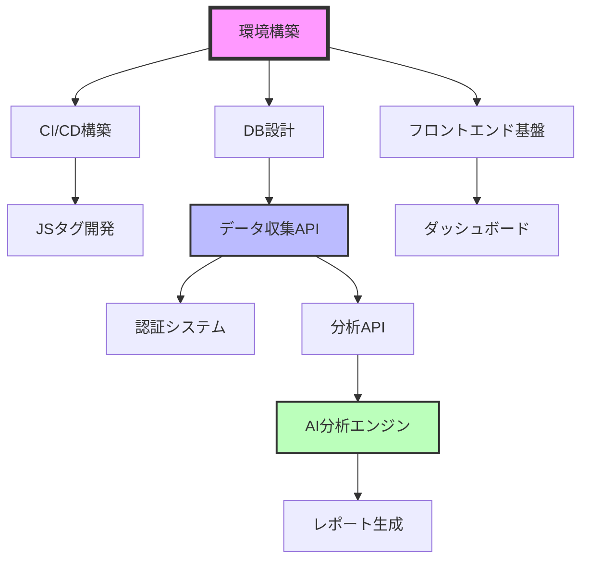

# AIウェブ分析システム - 開発ガイドライン詳細仕様

## 1. 開発タスク詳細分解

### 1.1 開発タスク一覧（WBS）

#### Phase 1: 基盤構築（2週間）

```yaml
T001_環境構築:
  担当: フルスタックエンジニア
  工数: 16時間
  前提条件: なし
  成果物:
    - Dockerコンテナ設定
    - 開発環境構築手順書
    - ローカル開発用docker-compose.yml
  サブタスク:
    - Node.js環境構築（2h）
    - PostgreSQL/Redisセットアップ（4h）
    - 開発ツール設定（ESLint, Prettier）（2h）
    - Git設定・ブランチ戦略決定（2h）
    - VSCode設定共有（1h）
    - 環境変数管理システム構築（2h）
    - SSL証明書（開発用）設定（2h）
    - ログ出力設定（1h）

T002_CI/CD構築:
  担当: フルスタックエンジニア
  工数: 24時間
  前提条件: T001完了
  成果物:
    - GitHub Actions設定ファイル
    - 自動テストパイプライン
    - デプロイメントパイプライン
  サブタスク:
    - GitHub Actions基本設定（4h）
    - 自動テスト実行設定（6h）
    - コードカバレッジ計測設定（3h）
    - ESLint/Prettier自動実行（2h）
    - ビルドエラー検知設定（3h）
    - Slack通知設定（2h）
    - デプロイ自動化（ステージング）（4h）

T003_データベース設計実装:
  担当: フルスタックエンジニア
  工数: 20時間
  前提条件: T001完了
  成果物:
    - マイグレーションファイル
    - シードデータ
    - ER図（最終版）
  サブタスク:
    - Prismaセットアップ（3h）
    - スキーマ定義（6h）
    - マイグレーション作成（4h）
    - インデックス最適化（3h）
    - シードデータ作成（2h）
    - パフォーマンステスト（2h）
```

#### Phase 2: コア機能開発（6週間）

```yaml
T004_JavaScriptタグ開発:
  担当: フルスタックエンジニア
  工数: 40時間
  前提条件: T001, T002完了
  成果物:
    - tag.js（本番用）
    - tag.min.js（圧縮版）
    - 実装ドキュメント
  サブタスク:
    - 基本構造実装（8h）
    - データ収集ロジック（12h）
    - バッチ送信機能（6h）
    - エラーハンドリング（4h）
    - 圧縮・最適化（3h）
    - クロスブラウザテスト（5h）
    - パフォーマンス最適化（2h）
  
T005_データ収集API:
  担当: フルスタックエンジニア  
  工数: 48時間
  前提条件: T003完了
  成果物:
    - APIエンドポイント実装
    - API仕様書（OpenAPI）
    - 単体テスト
  サブタスク:
    - Express.js基本設定（4h）
    - /api/collect実装（12h）
    - バリデーション実装（8h）
    - レート制限実装（6h）
    - 認証・認可実装（8h）
    - エラーハンドリング（4h）
    - ログ記録実装（3h）
    - 単体テスト作成（3h）

T006_ユーザー認証システム:
  担当: フルスタックエンジニア
  工数: 32時間
  前提条件: T005完了
  成果物:
    - 認証API
    - セッション管理
    - パスワードリセット機能
  サブタスク:
    - JWT実装（6h）
    - ログインAPI（4h）
    - 登録API（4h）
    - パスワードハッシュ化（2h）
    - セッション管理（6h）
    - パスワードリセット（6h）
    - 2段階認証（準備）（4h）

T007_フロントエンド基盤:
  担当: フルスタックエンジニア
  工数: 24時間
  前提条件: T001完了
  成果物:
    - Reactプロジェクト設定
    - 共通コンポーネント
    - ルーティング設定
  サブタスク:
    - Create React App設定（2h）
    - Material-UI導入（2h）
    - Redux設定（4h）
    - ルーティング設定（3h）
    - 認証状態管理（4h）
    - API通信基盤（4h）
    - エラーバウンダリ（2h）
    - 共通レイアウト（3h）

T008_ダッシュボード画面:
  担当: フルスタックエンジニア
  工数: 60時間
  前提条件: T007完了
  成果物:
    - ダッシュボード画面
    - リアルタイム更新機能
    - レスポンシブ対応
  サブタスク:
    - 画面レイアウト実装（8h）
    - メトリクスカード（8h）
    - Chart.js統合（12h）
    - 期間選択機能（6h）
    - データ取得・更新（8h）
    - リアルタイム更新（10h）
    - レスポンシブ対応（6h）
    - アクセシビリティ対応（2h）

T009_分析データAPI:
  担当: フルスタックエンジニア
  工数: 40時間
  前提条件: T005完了
  成果物:
    - 分析データ取得API
    - 集計バッチ処理
    - キャッシュ機能
  サブタスク:
    - 基本統計API（8h）
    - 時系列データAPI（8h）
    - 集計処理実装（10h）
    - Redisキャッシュ（6h）
    - バッチ処理設定（4h）
    - パフォーマンス最適化（4h）
```

#### Phase 3: AI機能開発（4週間）

```yaml
T010_AI分析エンジン:
  担当: フルスタックエンジニア
  工数: 80時間
  前提条件: T009完了
  成果物:
    - Python分析エンジン
    - 異常検知機能
    - トレンド分析
  サブタスク:
    - Flask API設定（8h）
    - データ取得処理（8h）
    - 異常検知アルゴリズム（16h）
    - トレンド分析実装（16h）
    - OpenAI API統合（12h）
    - インサイト生成（12h）
    - テスト・調整（8h）

T011_レポート生成:
  担当: フルスタックエンジニア
  工数: 32時間
  前提条件: T010完了
  成果物:
    - 定期レポート生成
    - PDF出力機能
    - メール送信
  サブタスク:
    - レポートテンプレート（8h）
    - PDF生成機能（8h）
    - スケジューラー設定（6h）
    - メール送信機能（6h）
    - テスト実装（4h）
```

### 1.2 タスク依存関係図



---

## 2. デザイン要件・デザインシステム

### 2.1 デザイン原則

```yaml
基本原則:
  シンプルさ: 
    - 情報過多を避ける
    - 重要な指標を目立たせる
    - 3クリック以内で目的達成
  
  一貫性:
    - 統一されたカラーパレット
    - 一貫したコンポーネント
    - 予測可能な動作
  
  アクセシビリティ:
    - WCAG 2.1 AA準拠
    - カラーコントラスト比4.5:1以上
    - キーボード操作完全対応
```

### 2.2 カラーパレット

```scss
// プライマリカラー
$primary-main: #1976d2;    // メインブルー
$primary-light: #42a5f5;   // ライトブルー
$primary-dark: #1565c0;    // ダークブルー

// セカンダリカラー
$secondary-main: #dc004e;  // アクセントレッド
$secondary-light: #f73378; // ライトレッド
$secondary-dark: #9a0036;  // ダークレッド

// グレースケール
$grey-50: #fafafa;
$grey-100: #f5f5f5;
$grey-200: #eeeeee;
$grey-300: #e0e0e0;
$grey-400: #bdbdbd;
$grey-500: #9e9e9e;
$grey-600: #757575;
$grey-700: #616161;
$grey-800: #424242;
$grey-900: #212121;

// ステータスカラー
$success: #4caf50;    // 成功・増加
$warning: #ff9800;    // 警告
$error: #f44336;      // エラー・減少
$info: #2196f3;       // 情報

// 背景色
$background-default: #fafafa;
$background-paper: #ffffff;
$background-dark: #121212;
```

### 2.3 タイポグラフィ

```scss
// フォントファミリー
$font-family-primary: "'Noto Sans JP', 'Helvetica', 'Arial', sans-serif";
$font-family-mono: "'Source Code Pro', 'Courier New', monospace";

// フォントサイズ
$font-size-h1: 2.5rem;     // 40px
$font-size-h2: 2rem;       // 32px
$font-size-h3: 1.75rem;    // 28px
$font-size-h4: 1.5rem;     // 24px
$font-size-h5: 1.25rem;    // 20px
$font-size-h6: 1rem;       // 16px
$font-size-body1: 1rem;    // 16px
$font-size-body2: 0.875rem; // 14px
$font-size-caption: 0.75rem; // 12px

// フォントウェイト
$font-weight-light: 300;
$font-weight-regular: 400;
$font-weight-medium: 500;
$font-weight-bold: 700;

// 行間
$line-height-tight: 1.2;
$line-height-normal: 1.5;
$line-height-relaxed: 1.8;
```

### 2.4 コンポーネント仕様

#### メトリクスカード
```jsx
// MetricCard.jsx 仕様
interface MetricCardProps {
  title: string;        // 指標名
  value: number;        // 現在値
  previousValue?: number; // 前期間値
  format?: 'number' | 'currency' | 'percentage' | 'duration';
  trend?: 'up' | 'down' | 'neutral';
  loading?: boolean;
}

// デザイン仕様
{
  borderRadius: '8px',
  padding: '24px',
  boxShadow: '0 2px 4px rgba(0,0,0,0.1)',
  minHeight: '120px',
  transition: 'all 0.3s ease',
  ':hover': {
    boxShadow: '0 4px 8px rgba(0,0,0,0.15)',
    transform: 'translateY(-2px)'
  }
}
```

#### グラフコンポーネント
```jsx
// 共通グラフ設定
const chartConfig = {
  colors: ['#1976d2', '#4caf50', '#ff9800', '#f44336'],
  fontFamily: 'Noto Sans JP',
  fontSize: 12,
  gridColor: '#e0e0e0',
  tooltipStyle: {
    backgroundColor: 'rgba(0, 0, 0, 0.8)',
    border: 'none',
    borderRadius: '4px',
    padding: '8px 12px'
  }
};
```

### 2.5 レスポンシブ設計

```scss
// ブレークポイント
$breakpoint-xs: 0;      // スマートフォン
$breakpoint-sm: 600px;  // タブレット（縦）
$breakpoint-md: 960px;  // タブレット（横）
$breakpoint-lg: 1280px; // デスクトップ
$breakpoint-xl: 1920px; // 大画面

// グリッドシステム
.container {
  width: 100%;
  margin: 0 auto;
  padding: 0 16px;
  
  @media (min-width: $breakpoint-sm) {
    padding: 0 24px;
  }
  
  @media (min-width: $breakpoint-md) {
    padding: 0 32px;
    max-width: 960px;
  }
  
  @media (min-width: $breakpoint-lg) {
    max-width: 1200px;
  }
}
```

### 2.6 アニメーション仕様

```scss
// トランジション
$transition-base: all 0.3s cubic-bezier(0.4, 0, 0.2, 1);
$transition-fade: opacity 0.2s ease-in-out;
$transition-slide: transform 0.3s ease-out;

// アニメーション
@keyframes fadeIn {
  from { opacity: 0; }
  to { opacity: 1; }
}

@keyframes slideUp {
  from { 
    opacity: 0;
    transform: translateY(20px);
  }
  to { 
    opacity: 1;
    transform: translateY(0);
  }
}

// ローディングアニメーション
@keyframes pulse {
  0% { opacity: 1; }
  50% { opacity: 0.5; }
  100% { opacity: 1; }
}
```

---

## 3. 開発ガイドライン・コーディング規約

### 3.1 全般的なルール

```yaml
基本原則:
  可読性優先:
    - コードは書く時間より読む時間の方が長い
    - 明確で自己文書化されたコード
    - 適切なコメント（なぜそうしたか）
  
  保守性:
    - DRY原則の遵守
    - 単一責任の原則
    - 疎結合・高凝集
  
  一貫性:
    - チーム内で統一されたスタイル
    - 自動フォーマッターの活用
    - 命名規則の徹底
```

### 3.2 JavaScript/TypeScript規約

```javascript
/**
 * ファイル名: camelCase.js または PascalCase.tsx（コンポーネント）
 * 
 * インポート順序:
 * 1. 外部ライブラリ
 * 2. 内部モジュール
 * 3. 相対パス
 * 4. スタイル
 */

// ✅ 良い例
import React, { useState, useEffect } from 'react';
import { Button, TextField } from '@mui/material';
import { analyticsAPI } from '@/services/api';
import { formatDate } from '@/utils/date';
import MetricCard from './MetricCard';
import styles from './Dashboard.module.css';

// ❌ 悪い例
import styles from './Dashboard.module.css';
import React from 'react';
import MetricCard from './MetricCard';

/**
 * 命名規則
 */
// 定数: UPPER_SNAKE_CASE
const MAX_RETRY_COUNT = 3;
const API_TIMEOUT = 5000;

// 変数・関数: camelCase
let userCount = 0;
function calculateBounceRate(sessions, bounced) {
  return (bounced / sessions) * 100;
}

// クラス・コンポーネント: PascalCase
class DataProcessor {
  constructor() {}
}

const DashboardComponent = () => {};

// プライベートメソッド: _始まり
class Analytics {
  _processData(data) {
    // 内部処理
  }
}

/**
 * 関数の書き方
 */
// ✅ 良い例: 単一責任、明確な名前
function validateEmail(email) {
  const emailRegex = /^[^\s@]+@[^\s@]+\.[^\s@]+$/;
  return emailRegex.test(email);
}

// ✅ 良い例: エラーハンドリング
async function fetchUserData(userId) {
  try {
    const response = await api.get(`/users/${userId}`);
    if (!response.ok) {
      throw new Error(`Failed to fetch user: ${response.status}`);
    }
    return response.data;
  } catch (error) {
    logger.error('Error fetching user data:', error);
    throw error;
  }
}

// ❌ 悪い例: 複数の責任、不明確な名前
function processData(d) {
  // データ取得
  const data = fetch('/api/data');
  // 計算
  const result = data.map(x => x * 2);
  // 保存
  save(result);
  // 通知
  notify();
}

/**
 * コメントの書き方
 */
// ✅ 良い例: なぜそうしたかを説明
// ユーザーがオフラインの可能性があるため、
// ローカルストレージに一時保存してリトライする
if (!navigator.onLine) {
  saveToLocalStorage(data);
  scheduleRetry();
}

// ❌ 悪い例: 何をしているか（コードを読めばわかる）
// データを取得する
const data = await fetchData();

/**
 * React コンポーネントの規約
 */
// ✅ 良い例
const MetricCard = ({ title, value, trend }) => {
  // フックは最上部に
  const [isLoading, setIsLoading] = useState(false);
  const theme = useTheme();
  
  // 副作用は useEffect で
  useEffect(() => {
    // クリーンアップ関数を忘れずに
    return () => {
      // cleanup
    };
  }, [value]);
  
  // イベントハンドラーは handle プレフィックス
  const handleClick = () => {
    // 処理
  };
  
  // 条件付きレンダリング
  if (isLoading) {
    return <CircularProgress />;
  }
  
  return (
    <Card onClick={handleClick}>
      <CardContent>
        <Typography>{title}</Typography>
        <Typography variant="h4">{value}</Typography>
      </CardContent>
    </Card>
  );
};

// PropTypes または TypeScript の型定義
MetricCard.propTypes = {
  title: PropTypes.string.isRequired,
  value: PropTypes.number.isRequired,
  trend: PropTypes.oneOf(['up', 'down', 'neutral'])
};
```

### 3.3 CSS/SCSS規約

```scss
/**
 * ファイル構成
 * styles/
 *   ├── globals.scss      // グローバルスタイル
 *   ├── variables.scss    // 変数定義
 *   ├── mixins.scss      // ミックスイン
 *   └── components/      // コンポーネント別
 */

// BEM命名規則
.dashboard {
  &__header {
    // ブロック__エレメント
  }
  
  &__title {
    &--large {
      // ブロック__エレメント--モディファイア
    }
  }
  
  &--dark {
    // ブロック--モディファイア
  }
}

// ✅ 良い例: 構造化、変数使用
.metric-card {
  padding: $spacing-3;
  border-radius: $border-radius-base;
  background-color: $color-background-paper;
  transition: $transition-base;
  
  &:hover {
    box-shadow: $shadow-hover;
    transform: translateY(-2px);
  }
  
  &__title {
    font-size: $font-size-body2;
    color: $color-text-secondary;
    margin-bottom: $spacing-1;
  }
  
  &__value {
    font-size: $font-size-h4;
    font-weight: $font-weight-bold;
    color: $color-text-primary;
  }
}

// ❌ 悪い例: マジックナンバー、非構造的
.card {
  padding: 24px;
  border-radius: 8px;
  background: white;
}

.card:hover {
  box-shadow: 0 4px 8px rgba(0,0,0,0.15);
  transform: translateY(-2px);
}

.card-title {
  font-size: 14px;
  color: #666;
  margin-bottom: 8px;
}
```

### 3.4 Git コミット規約

```bash
# コミットメッセージフォーマット
<type>(<scope>): <subject>

<body>

<footer>

# type の種類
feat:     新機能
fix:      バグ修正
docs:     ドキュメントのみ変更
style:    フォーマット変更（コードの動作に影響なし）
refactor: リファクタリング
perf:     パフォーマンス改善
test:     テスト追加・修正
chore:    ビルドプロセスやツールの変更
ci:       CI/CD設定の変更

# ✅ 良い例
feat(dashboard): リアルタイム更新機能を追加

- WebSocket接続でリアルタイムデータ取得
- 5秒ごとの自動更新オプション追加
- 更新インジケーター表示

Closes #123

# ❌ 悪い例
updated files
fix bug
WIP
```

---

## 4. ビルドエラー防止策

### 4.1 プリコミットフック設定

```json
// package.json
{
  "husky": {
    "hooks": {
      "pre-commit": "lint-staged",
      "pre-push": "npm run test:ci"
    }
  },
  "lint-staged": {
    "*.{js,jsx,ts,tsx}": [
      "eslint --fix",
      "prettier --write",
      "jest --bail --findRelatedTests"
    ],
    "*.{css,scss}": [
      "stylelint --fix",
      "prettier --write"
    ]
  }
}
```

### 4.2 ESLint設定

```javascript
// .eslintrc.js
module.exports = {
  extends: [
    'eslint:recommended',
    'plugin:react/recommended',
    'plugin:@typescript-eslint/recommended',
    'prettier'
  ],
  plugins: ['react', '@typescript-eslint', 'import'],
  rules: {
    // エラーレベルのルール（ビルドエラー防止）
    'no-unused-vars': 'error',
    'no-undef': 'error',
    'no-console': ['error', { allow: ['warn', 'error'] }],
    'import/no-unresolved': 'error',
    'import/no-circular': 'error',
    'react/prop-types': 'error',
    'react/jsx-no-undef': 'error',
    '@typescript-eslint/explicit-module-boundary-types': 'error',
    
    // 警告レベルのルール
    'no-debugger': 'warn',
    'prefer-const': 'warn',
    'react/jsx-key': 'warn'
  },
  settings: {
    'import/resolver': {
      node: {
        extensions: ['.js', '.jsx', '.ts', '.tsx']
      },
      alias: {
        map: [['@', './src']],
        extensions: ['.js', '.jsx', '.ts', '.tsx']
      }
    }
  }
};
```

### 4.3 TypeScript設定

```json
// tsconfig.json
{
  "compilerOptions": {
    "target": "ES2020",
    "lib": ["ES2020", "DOM", "DOM.Iterable"],
    "jsx": "react-jsx",
    "module": "esnext",
    "moduleResolution": "node",
    "resolveJsonModule": true,
    "allowJs": true,
    "checkJs": true,
    
    // 厳格な型チェック
    "strict": true,
    "noImplicitAny": true,
    "strictNullChecks": true,
    "strictFunctionTypes": true,
    "strictBindCallApply": true,
    "strictPropertyInitialization": true,
    "noImplicitThis": true,
    "alwaysStrict": true,
    
    // エラー検出
    "noUnusedLocals": true,
    "noUnusedParameters": true,
    "noImplicitReturns": true,
    "noFallthroughCasesInSwitch": true,
    "noUncheckedIndexedAccess": true,
    
    // モジュール解決
    "esModuleInterop": true,
    "allowSyntheticDefaultImports": true,
    "forceConsistentCasingInFileNames": true,
    
    // パス設定
    "baseUrl": ".",
    "paths": {
      "@/*": ["src/*"]
    }
  },
  "include": ["src/**/*"],
  "exclude": ["node_modules", "build", "dist"]
}
```

### 4.4 CI/CD設定

```yaml
# .github/workflows/ci.yml
name: CI

on:
  push:
    branches: [main, develop]
  pull_request:
    branches: [main, develop]

jobs:
  lint:
    runs-on: ubuntu-latest
    steps:
      - uses: actions/checkout@v3
      - uses: actions/setup-node@v3
        with:
          node-version: '20'
          cache: 'npm'
      
      - name: Install dependencies
        run: npm ci
      
      - name: Run ESLint
        run: npm run lint
      
      - name: Run Prettier check
        run: npm run format:check
      
      - name: Type check
        run: npm run type-check

  test:
    runs-on: ubuntu-latest
    steps:
      - uses: actions/checkout@v3
      - uses: actions/setup-node@v3
        with:
          node-version: '20'
          cache: 'npm'
      
      - name: Install dependencies
        run: npm ci
      
      - name: Run tests
        run: npm run test:ci
      
      - name: Upload coverage
        uses: codecov/codecov-action@v3
        with:
          file: ./coverage/lcov.info
          fail_ci_if_error: true

  build:
    runs-on: ubuntu-latest
    needs: [lint, test]
    steps:
      - uses: actions/checkout@v3
      - uses: actions/setup-node@v3
        with:
          node-version: '20'
          cache: 'npm'
      
      - name: Install dependencies
        run: npm ci
      
      - name: Build application
        run: npm run build
      
      - name: Check build output
        run: |
          if [ ! -d "build" ]; then
            echo "Build directory not found!"
            exit 1
          fi
      
      - name: Upload build artifacts
        uses: actions/upload-artifact@v3
        with:
          name: build-files
          path: build/
          retention-days: 7

  security:
    runs-on: ubuntu-latest
    steps:
      - uses: actions/checkout@v3
      - name: Run security audit
        run: npm audit --audit-level=high
      
      - name: Run Snyk security check
        uses: snyk/actions/node@master
        env:
          SNYK_TOKEN: ${{ secrets.SNYK_TOKEN }}
```

### 4.5 ビルド前チェックスクリプト

```javascript
// scripts/pre-build-check.js
const fs = require('fs');
const path = require('path');
const { execSync } = require('child_process');

console.log('🔍 実行前チェックを開始...\n');

// 1. 環境変数チェック
console.log('1️⃣ 環境変数をチェック中...');
const requiredEnvVars = [
  'REACT_APP_API_URL',
  'REACT_APP_TRACKING_ID',
  'NODE_ENV'
];

const missingEnvVars = requiredEnvVars.filter(
  varName => !process.env[varName]
);

if (missingEnvVars.length > 0) {
  console.error('❌ 必須環境変数が設定されていません:');
  missingEnvVars.forEach(varName => {
    console.error(`   - ${varName}`);
  });
  process.exit(1);
}
console.log('✅ 環境変数 OK\n');

// 2. 依存関係チェック
console.log('2️⃣ 依存関係をチェック中...');
try {
  execSync('npm ls', { stdio: 'pipe' });
  console.log('✅ 依存関係 OK\n');
} catch (error) {
  console.error('❌ 依存関係に問題があります');
  console.error('   npm install を実行してください');
  process.exit(1);
}

// 3. TypeScriptコンパイルチェック
console.log('3️⃣ TypeScriptコンパイルをチェック中...');
try {
  execSync('npx tsc --noEmit', { stdio: 'pipe' });
  console.log('✅ TypeScript OK\n');
} catch (error) {
  console.error('❌ TypeScriptコンパイルエラー');
  execSync('npx tsc --noEmit', { stdio: 'inherit' });
  process.exit(1);
}

// 4. ESLintチェック
console.log('4️⃣ ESLintをチェック中...');
try {
  execSync('npm run lint', { stdio: 'pipe' });
  console.log('✅ ESLint OK\n');
} catch (error) {
  console.error('❌ ESLintエラー');
  execSync('npm run lint', { stdio: 'inherit' });
  process.exit(1);
}

// 5. テスト実行
console.log('5️⃣ テストを実行中...');
try {
  execSync('npm test -- --passWithNoTests', { stdio: 'pipe' });
  console.log('✅ テスト OK\n');
} catch (error) {
  console.error('❌ テスト失敗');
  execSync('npm test', { stdio: 'inherit' });
  process.exit(1);
}

console.log('✨ すべてのチェックが完了しました！ビルドを開始できます。');
```

---

## 5. 専門エージェントの役割定義

### 5.1 エージェント役割マトリクス

```yaml
フロントエンドエージェント:
  責任範囲:
    - React/TypeScriptコード
    - UI/UXの実装
    - パフォーマンス最適化
    - アクセシビリティ
  レビュー項目:
    - コンポーネント設計
    - 状態管理の適切性
    - レンダリング効率
    - バンドルサイズ
  必須スキル:
    - React 18+
    - TypeScript
    - CSS/SCSS
    - Webpack/Vite

バックエンドエージェント:
  責任範囲:
    - API設計・実装
    - データベース設計
    - セキュリティ実装
    - パフォーマンスチューニング
  レビュー項目:
    - APIの一貫性
    - エラーハンドリング
    - SQLクエリ効率
    - セキュリティ脆弱性
  必須スキル:
    - Node.js/Express
    - PostgreSQL
    - Redis
    - REST API設計

AIエージェント:
  責任範囲:
    - 分析アルゴリズム
    - 機械学習モデル
    - データ前処理
    - インサイト生成
  レビュー項目:
    - アルゴリズムの正確性
    - 処理速度
    - スケーラビリティ
    - 結果の解釈性
  必須スキル:
    - Python
    - 統計学
    - 機械学習
    - データ分析

DevOpsエージェント:
  責任範囲:
    - インフラ構築
    - CI/CD管理
    - 監視・アラート
    - セキュリティ設定
  レビュー項目:
    - インフラコード
    - デプロイプロセス
    - 監視設定
    - コスト最適化
  必須スキル:
    - AWS/Docker
    - GitHub Actions
    - Terraform
    - 監視ツール

QAエージェント:
  責任範囲:
    - テスト戦略
    - テストケース作成
    - バグ管理
    - 品質メトリクス
  レビュー項目:
    - テストカバレッジ
    - エッジケース
    - 回帰テスト
    - パフォーマンステスト
  必須スキル:
    - Jest/Cypress
    - 負荷テスト
    - セキュリティテスト
    - テスト自動化
```

### 5.2 レビュープロセス

```yaml
プルリクエストレビューフロー:
  1_自動チェック:
    - CI/CDパイプライン実行
    - コードカバレッジ確認（80%以上）
    - セキュリティスキャン
    - ビルド成功確認
  
  2_エージェントレビュー:
    担当決定:
      - フロントエンド変更 → フロントエンドエージェント
      - API変更 → バックエンドエージェント
      - インフラ変更 → DevOpsエージェント
      - 複数領域 → 関連する全エージェント
    
    レビュー基準:
      - コーディング規約準拠
      - パフォーマンス影響
      - セキュリティリスク
      - テストの適切性
  
  3_相互レビュー:
    - 最低2名のレビュー必須
    - 重大変更は3名以上
    - 24時間以内にレビュー開始
    - 48時間以内に完了
  
  4_マージ条件:
    - 全自動テストパス
    - 2名以上の承認
    - コンフリクト解消
    - ドキュメント更新
```

### 5.3 エスカレーションパス

```yaml
問題レベル定義:
  Level1_軽微:
    - コーディングスタイル
    - 軽微なリファクタリング
    対応: 開発者間で解決
  
  Level2_中程度:
    - 設計変更
    - API仕様変更
    - パフォーマンス問題
    対応: テックリードに相談
  
  Level3_重大:
    - アーキテクチャ変更
    - セキュリティ問題
    - データ損失リスク
    対応: プロジェクトオーナーに報告
  
  Level4_緊急:
    - 本番障害
    - データ漏洩
    - サービス停止
    対応: 全員で対応、顧客に報告
```

---

## 6. 品質保証チェックリスト

### 6.1 コードレビューチェックリスト

```markdown
## 一般項目
- [ ] コードは要件を満たしているか
- [ ] 既存機能への影響はないか
- [ ] コーディング規約に準拠しているか
- [ ] 適切なコメントがあるか
- [ ] デバッグコードは削除されているか

## パフォーマンス
- [ ] N+1問題はないか
- [ ] 不要なループはないか
- [ ] キャッシュは適切に使用されているか
- [ ] 大量データ処理に対応しているか
- [ ] メモリリークの可能性はないか

## セキュリティ
- [ ] 入力値の検証は適切か
- [ ] SQLインジェクション対策はあるか
- [ ] XSS対策はあるか
- [ ] 認証・認可は適切か
- [ ] 機密情報のログ出力はないか

## テスト
- [ ] 単体テストは書かれているか
- [ ] エッジケースはカバーされているか
- [ ] テストは意味のあるものか
- [ ] モックは適切に使用されているか
- [ ] カバレッジは基準を満たしているか

## ドキュメント
- [ ] README は更新されているか
- [ ] API仕様書は更新されているか
- [ ] 変更履歴は記載されているか
- [ ] 環境構築手順は最新か
```

### 6.2 リリース前チェックリスト

```markdown
## 開発完了確認
- [ ] 全機能要件を満たしている
- [ ] 全非機能要件を満たしている
- [ ] 既知のバグはすべて修正済み
- [ ] コードレビュー完了
- [ ] ドキュメント更新完了

## テスト完了確認
- [ ] 単体テスト: カバレッジ80%以上
- [ ] 結合テスト: 全シナリオパス
- [ ] E2Eテスト: 主要フローパス
- [ ] 性能テスト: 要件値達成
- [ ] セキュリティテスト: 脆弱性なし
- [ ] ユーザビリティテスト: 完了

## インフラ・環境
- [ ] 本番環境構築完了
- [ ] SSL証明書設定
- [ ] ドメイン設定
- [ ] バックアップ設定
- [ ] 監視・アラート設定
- [ ] ログ設定

## 運用準備
- [ ] 運用手順書作成
- [ ] 障害対応手順書作成
- [ ] 監視項目定義
- [ ] エスカレーションパス定義
- [ ] サポート体制確立

## 最終確認
- [ ] ステージング環境で最終テスト
- [ ] パフォーマンス基準クリア
- [ ] セキュリティスキャン完了
- [ ] ライセンス確認
- [ ] リリースノート作成
```

### 6.3 本番移行チェックリスト

```markdown
## 事前準備（1週間前）
- [ ] リリース日時の決定・周知
- [ ] 関係者への連絡
- [ ] リリース手順書の作成
- [ ] ロールバック手順の準備
- [ ] 必要な権限の確認

## 当日作業前（1時間前）
- [ ] 関係者の待機確認
- [ ] バックアップ実行
- [ ] 現在のシステム状態記録
- [ ] 監視ツールの確認
- [ ] 通信手段の確認

## リリース作業
- [ ] メンテナンス画面表示
- [ ] データベースマイグレーション
- [ ] アプリケーションデプロイ
- [ ] 設定ファイル更新
- [ ] 静的ファイル更新
- [ ] キャッシュクリア

## 動作確認
- [ ] ヘルスチェック
- [ ] 主要機能の動作確認
- [ ] データ整合性確認
- [ ] パフォーマンス確認
- [ ] ログ出力確認

## 完了作業
- [ ] メンテナンス画面解除
- [ ] 監視開始
- [ ] 関係者への完了連絡
- [ ] ドキュメント更新
- [ ] 振り返りミーティング設定
```

---

## 7. トラブルシューティングガイド

### 7.1 よくあるビルドエラーと対処法

```yaml
Module not found エラー:
  症状: Cannot resolve module 'xxx'
  原因: 
    - パッケージ未インストール
    - パスの誤り
    - 大文字小文字の違い
  対処:
    1. npm install 実行
    2. import パスを確認
    3. ファイル名の大文字小文字確認
    4. tsconfig.json の paths 設定確認

TypeScript エラー:
  症状: Type 'xxx' is not assignable to type 'yyy'
  原因:
    - 型定義の不一致
    - null/undefined の考慮不足
  対処:
    1. 型定義を確認・修正
    2. Optional chaining 使用
    3. Type assertion 使用（最終手段）

ESLint エラー:
  症状: Unexpected token
  原因:
    - 構文エラー
    - ESLint設定の問題
  対処:
    1. 構文を確認
    2. .eslintrc.js の設定確認
    3. parser の設定確認

依存関係の競合:
  症状: npm ERR! peer dep missing
  原因:
    - バージョンの不一致
    - 依存関係の競合
  対処:
    1. npm ls で依存関係確認
    2. package-lock.json 削除して再インストール
    3. npm audit fix 実行
```

### 7.2 パフォーマンス問題の診断

```javascript
// パフォーマンス計測ユーティリティ
class PerformanceMonitor {
  constructor() {
    this.marks = new Map();
  }
  
  start(label) {
    this.marks.set(label, performance.now());
  }
  
  end(label) {
    const startTime = this.marks.get(label);
    if (!startTime) {
      console.error(`No start mark found for ${label}`);
      return;
    }
    
    const duration = performance.now() - startTime;
    console.log(`${label}: ${duration.toFixed(2)}ms`);
    
    // 閾値を超えたら警告
    if (duration > 1000) {
      console.warn(`⚠️ ${label} took more than 1 second!`);
    }
    
    this.marks.delete(label);
    return duration;
  }
}

// 使用例
const perf = new PerformanceMonitor();

perf.start('データ取得');
const data = await fetchData();
perf.end('データ取得');

perf.start('レンダリング');
renderDashboard(data);
perf.end('レンダリング');
```

---

これらのドキュメントにより、開発者は明確な指針を持って開発を進めることができ、ビルドエラーや品質問題を未然に防ぐことができます。