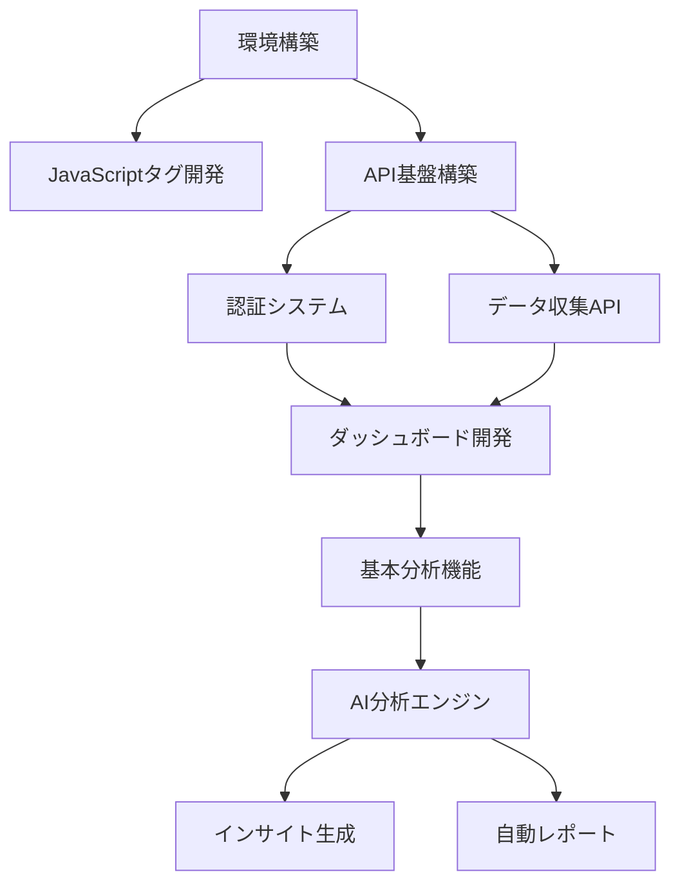

# AIウェブ分析システム 開発ドキュメント

## 文書情報
- **文書名**: AIウェブ分析システム開発ドキュメント
- **バージョン**: 1.0
- **作成日**: 2025年1月20日
- **対象者**: 開発エンジニア、デザイナー、QAエンジニア

---

## 目次
1. [開発タスク詳細](#1-開発タスク詳細)
2. [デザイン要件・仕様](#2-デザイン要件仕様)
3. [開発ガイドライン](#3-開発ガイドライン)
4. [ビルドエラー防止策](#4-ビルドエラー防止策)
5. [専門エージェントの役割](#5-専門エージェントの役割)
6. [品質保証基準](#6-品質保証基準)
7. [トラブルシューティング](#7-トラブルシューティング)

---

## 1. 開発タスク詳細

### 1.1 タスク分解構造（WBS）

#### Phase 1: 環境構築タスク（2週間）

```markdown
1. 開発環境セットアップ（3日）
   1.1 リポジトリ作成・初期設定
       - GitHubリポジトリ作成
       - .gitignore設定（Node.js, React, Python用）
       - README.md作成
       - ブランチ戦略設定（main, develop, feature/*）
       
   1.2 Docker環境構築
       - docker-compose.yml作成
       - 開発用コンテナ定義（Node.js, PostgreSQL, Redis）
       - 環境変数設定（.env.example）
       
   1.3 IDE設定
       - VSCode推奨拡張機能リスト作成
       - ESLint/Prettier設定
       - デバッグ設定

2. CI/CD環境構築（2日）
   2.1 GitHub Actions設定
       - 自動テスト用ワークフロー
       - ビルド検証用ワークフロー
       - デプロイ用ワークフロー
       
   2.2 テスト環境準備
       - Jest設定（単体テスト）
       - Cypress設定（E2Eテスト）
       - カバレッジレポート設定

3. AWS環境準備（3日）
   3.1 AWSアカウント設定
       - IAMユーザー作成
       - アクセスキー発行
       - 必要なポリシー設定
       
   3.2 開発環境リソース作成
       - VPC/サブネット作成
       - セキュリティグループ設定
       - EC2インスタンス起動（t3.micro）
       
   3.3 データベース環境
       - RDS（PostgreSQL）インスタンス作成
       - ElastiCache（Redis）作成
       - バックアップ設定

4. 基本構成作成（2日）
   4.1 プロジェクト構造作成
       - モノレポ構成（frontend/, backend/, scripts/）
       - 共通ライブラリ設定
       - 設定ファイル配置
```

#### Phase 2: 基本機能開発タスク（6週間）

```markdown
5. JavaScriptタグ開発（1週間）
   5.1 基本実装（3日）
       - タグローダー実装
       - イベント収集ロジック
       - データ送信機能
       - エラーハンドリング
       
   5.2 最適化（2日）
       - ファイルサイズ最小化（<10KB）
       - 非同期読み込み実装
       - ブラウザ互換性対応
       
   5.3 テスト（2日）
       - 単体テスト作成
       - クロスブラウザテスト
       - パフォーマンステスト

6. データ収集API開発（1週間）
   6.1 基本API実装（3日）
       - Express.jsサーバー構築
       - /api/collectエンドポイント
       - データバリデーション
       - エラーレスポンス設計
       
   6.2 データ処理（2日）
       - バッチ処理実装
       - データベース保存
       - キャッシュ更新
       
   6.3 セキュリティ実装（2日）
       - レート制限
       - CORS設定
       - 認証トークン検証

7. ユーザー認証システム（1週間）
   7.1 認証API（3日）
       - 登録エンドポイント
       - ログインエンドポイント
       - JWT実装
       - リフレッシュトークン
       
   7.2 パスワード管理（2日）
       - bcryptハッシュ化
       - パスワードリセット機能
       - メール送信実装
       
   7.3 セッション管理（2日）
       - Redis セッション保存
       - タイムアウト処理
       - 同時ログイン制限

8. ダッシュボード画面開発（2週間）
   8.1 UIコンポーネント作成（1週間）
       - レイアウトコンポーネント
       - メトリクスカード
       - グラフコンポーネント
       - データテーブル
       
   8.2 状態管理実装（3日）
       - Redux Toolkit設定
       - API連携
       - リアルタイム更新
       
   8.3 レスポンシブ対応（4日）
       - モバイル最適化
       - タブレット対応
       - プリント対応

9. 基本分析機能（1週間）
   9.1 データ集計処理（3日）
       - 時系列集計
       - ディメンション別集計
       - キャッシュ戦略
       
   9.2 統計計算（2日）
       - 基本統計量
       - トレンド計算
       - 前期間比較
       
   9.3 レポート生成（2日）
       - データ整形
       - グラフデータ生成
       - エクスポート機能
```

#### Phase 3: AI機能開発タスク（4週間）

```markdown
10. AI分析エンジン（2週間）
    10.1 基盤構築（3日）
        - Python環境セットアップ
        - Flask API構築
        - データベース接続
        
    10.2 分析アルゴリズム（1週間）
        - 異常値検知実装
        - トレンド分析
        - 予測モデル構築
        - 統計的検定
        
    10.3 最適化（4日）
        - 処理速度改善
        - メモリ使用量最適化
        - 並列処理実装

11. インサイト生成機能（1週間）
    11.1 OpenAI連携（3日）
        - API接続実装
        - プロンプトエンジニアリング
        - レスポンス処理
        
    11.2 インサイト整形（2日）
        - 日本語最適化
        - ビジネス用語変換
        - 実行可能な提案生成
        
    11.3 品質管理（2日）
        - インサイト評価
        - フィードバックループ
        - 精度向上施策

12. 自動レポート機能（1週間）
    12.1 定期実行バッチ（3日）
        - スケジューラー実装
        - ジョブキュー管理
        - エラーリトライ
        
    12.2 レポート生成（2日）
        - テンプレート作成
        - 動的コンテンツ生成
        - PDF出力
        
    12.3 配信機能（2日）
        - メール送信
        - ダッシュボード表示
        - 通知システム
```

### 1.2 タスク優先順位マトリクス

| 優先度 | 緊急度高 | 緊急度低 |
|--------|----------|----------|
| **重要度高** | ・JavaScriptタグ実装<br>・データ収集API<br>・認証システム<br>・ダッシュボード基本機能 | ・AI分析エンジン<br>・インサイト生成<br>・性能最適化 |
| **重要度低** | ・エラー通知<br>・管理画面の細部調整 | ・多言語対応<br>・高度なカスタマイズ機能<br>・外部連携機能 |

### 1.3 タスク依存関係



---

## 2. デザイン要件・仕様

### 2.1 デザインシステム

#### カラーパレット
```scss
// Primary Colors
$primary-main: #1976D2;      // 青（メインカラー）
$primary-light: #42A5F5;     // 明るい青
$primary-dark: #1565C0;      // 暗い青

// Secondary Colors  
$secondary-main: #00BCD4;    // シアン（アクセント）
$secondary-light: #26C6DA;   // 明るいシアン
$secondary-dark: #00ACC1;    // 暗いシアン

// Status Colors
$success: #4CAF50;           // 緑（成功・増加）
$warning: #FF9800;           // オレンジ（警告）
$error: #F44336;             // 赤（エラー・減少）
$info: #2196F3;              // 青（情報）

// Neutral Colors
$gray-900: #212121;          // テキスト（主要）
$gray-700: #616161;          // テキスト（補助）
$gray-500: #9E9E9E;          // ボーダー
$gray-300: #E0E0E0;          // 背景（薄）
$gray-100: #F5F5F5;          // 背景（最薄）
$white: #FFFFFF;             // 白
```

#### タイポグラフィ
```scss
// Font Family
$font-family-base: 'Noto Sans JP', 'Helvetica Neue', Arial, sans-serif;
$font-family-mono: 'Source Code Pro', monospace;

// Font Sizes
$font-size-h1: 2.125rem;     // 34px
$font-size-h2: 1.5rem;       // 24px
$font-size-h3: 1.25rem;      // 20px
$font-size-h4: 1.125rem;     // 18px
$font-size-body1: 1rem;      // 16px
$font-size-body2: 0.875rem;  // 14px
$font-size-caption: 0.75rem; // 12px

// Font Weights
$font-weight-light: 300;
$font-weight-regular: 400;
$font-weight-medium: 500;
$font-weight-bold: 700;

// Line Heights
$line-height-tight: 1.2;
$line-height-normal: 1.5;
$line-height-relaxed: 1.75;
```

#### スペーシングシステム
```scss
// 8px グリッドシステム
$spacing-xs: 4px;    // 0.5
$spacing-sm: 8px;    // 1
$spacing-md: 16px;   // 2
$spacing-lg: 24px;   // 3
$spacing-xl: 32px;   // 4
$spacing-xxl: 48px;  // 6
$spacing-xxxl: 64px; // 8
```

### 2.2 コンポーネント仕様

#### ボタンコンポーネント
```jsx
// Button.jsx
import React from 'react';
import { Button as MuiButton } from '@mui/material';
import styled from '@emotion/styled';

const StyledButton = styled(MuiButton)`
  border-radius: 8px;
  text-transform: none;
  font-weight: 500;
  padding: ${props => props.size === 'large' ? '12px 24px' : '8px 16px'};
  transition: all 0.2s ease-in-out;
  
  &:hover {
    transform: translateY(-1px);
    box-shadow: 0 4px 8px rgba(0, 0, 0, 0.1);
  }
`;

export const Button = ({ children, ...props }) => (
  <StyledButton {...props}>{children}</StyledButton>
);

// 使用例
<Button variant="contained" color="primary" onClick={handleClick}>
  データを分析
</Button>
```

#### カードコンポーネント
```jsx
// MetricCard.jsx
import React from 'react';
import { Card, CardContent, Typography, Box } from '@mui/material';
import { TrendingUp, TrendingDown } from '@mui/icons-material';

export const MetricCard = ({ title, value, change, format }) => {
  const isPositive = change >= 0;
  const changeColor = isPositive ? '#4CAF50' : '#F44336';
  
  return (
    <Card sx={{ height: '100%', minHeight: 120 }}>
      <CardContent>
        <Typography variant="body2" color="text.secondary" gutterBottom>
          {title}
        </Typography>
        <Typography variant="h4" component="div" sx={{ mb: 1 }}>
          {format ? format(value) : value.toLocaleString()}
        </Typography>
        <Box display="flex" alignItems="center" gap={0.5}>
          {isPositive ? (
            <TrendingUp sx={{ fontSize: 16, color: changeColor }} />
          ) : (
            <TrendingDown sx={{ fontSize: 16, color: changeColor }} />
          )}
          <Typography variant="body2" sx={{ color: changeColor }}>
            {Math.abs(change)}%
          </Typography>
        </Box>
      </CardContent>
    </Card>
  );
};
```

### 2.3 レスポンシブデザイン仕様

#### ブレークポイント
```scss
$breakpoint-xs: 0;      // 携帯電話
$breakpoint-sm: 600px;  // タブレット（縦）
$breakpoint-md: 960px;  // タブレット（横）
$breakpoint-lg: 1280px; // デスクトップ
$breakpoint-xl: 1920px; // 大画面
```

#### グリッドレイアウト
```jsx
// レスポンシブグリッド例
<Grid container spacing={3}>
  <Grid item xs={12} sm={6} md={3}>
    <MetricCard title="ページビュー" value={15234} change={12.5} />
  </Grid>
  <Grid item xs={12} sm={6} md={3}>
    <MetricCard title="ユーザー数" value={3421} change={-5.2} />
  </Grid>
  <Grid item xs={12} sm={6} md={3}>
    <MetricCard title="セッション数" value={4532} change={8.7} />
  </Grid>
  <Grid item xs={12} sm={6} md={3}>
    <MetricCard title="直帰率" value={45.2} change={-2.1} format={v => `${v}%`} />
  </Grid>
</Grid>
```

### 2.4 アクセシビリティ要件

```markdown
1. WCAG 2.1 AA準拠
   - カラーコントラスト比: 最小4.5:1（通常テキスト）、3:1（大きいテキスト）
   - キーボードナビゲーション対応
   - スクリーンリーダー対応（ARIA属性）

2. フォーカス管理
   - 視覚的フォーカス表示
   - 論理的なタブ順序
   - モーダルのフォーカストラップ

3. エラー処理
   - 明確なエラーメッセージ
   - エラー箇所の視覚的強調
   - 修正方法の提示
```

---

## 3. 開発ガイドライン

### 3.1 コーディング規約

#### JavaScript/TypeScript
```javascript
// ファイル名: camelCase.js または PascalCase.tsx（コンポーネント）

// 1. 変数・関数名
const userName = 'John';              // camelCase
const MAX_RETRY_COUNT = 3;           // 定数は UPPER_SNAKE_CASE
const calculateTotalPrice = () => {}; // 動詞で始める

// 2. クラス・インターフェース
class UserAnalytics {}               // PascalCase
interface IUserData {}               // Iプレフィックス

// 3. インポート順序
import React from 'react';           // 1. React
import { useEffect } from 'react';   // 2. React関連
import axios from 'axios';           // 3. 外部ライブラリ
import { Button } from '@mui/material'; // 4. UIライブラリ
import { UserCard } from './components'; // 5. 内部コンポーネント
import { formatDate } from './utils';    // 6. ユーティリティ
import './styles.css';               // 7. スタイル

// 4. コメント
/**
 * ユーザーのアクセスデータを取得する
 * @param {string} userId - ユーザーID
 * @param {Date} startDate - 開始日
 * @param {Date} endDate - 終了日
 * @returns {Promise<AnalyticsData>} 分析データ
 */
async function fetchUserAnalytics(userId, startDate, endDate) {
  // 実装
}

// 5. エラーハンドリング
try {
  const data = await fetchData();
  return processData(data);
} catch (error) {
  console.error('データ取得エラー:', error);
  throw new CustomError('データの取得に失敗しました', error);
}
```

#### React コンポーネント
```jsx
// 1. 関数コンポーネントを使用
const Dashboard = ({ userId, timeRange }) => {
  // 2. フックは最上部に
  const [data, setData] = useState(null);
  const [loading, setLoading] = useState(true);
  const [error, setError] = useState(null);
  
  // 3. カスタムフックを活用
  const analytics = useAnalytics(userId, timeRange);
  
  // 4. useEffectは依存関係を明確に
  useEffect(() => {
    fetchData();
  }, [userId, timeRange]); // 依存配列を忘れない
  
  // 5. イベントハンドラーはhandle接頭辞
  const handleRefresh = () => {
    // 処理
  };
  
  // 6. 条件付きレンダリング
  if (loading) return <LoadingSpinner />;
  if (error) return <ErrorMessage error={error} />;
  
  // 7. メインのレンダリング
  return (
    <DashboardContainer>
      {/* コンテンツ */}
    </DashboardContainer>
  );
};

// 8. PropTypesまたはTypeScriptで型定義
Dashboard.propTypes = {
  userId: PropTypes.string.isRequired,
  timeRange: PropTypes.object.isRequired
};
```

#### CSS/SCSS
```scss
// 1. BEM命名規則
.dashboard {
  &__header {
    // ブロック__エレメント
  }
  
  &__content {
    &--active {
      // ブロック__エレメント--モディファイア
    }
  }
}

// 2. 変数を活用
.metric-card {
  padding: $spacing-md;
  background-color: $white;
  border-radius: 8px;
  box-shadow: 0 2px 4px rgba(0, 0, 0, 0.1);
  
  @media (max-width: $breakpoint-sm) {
    padding: $spacing-sm;
  }
}

// 3. ネストは3階層まで
.dashboard {
  .content {
    .card {
      // これ以上深くしない
    }
  }
}
```

### 3.2 Git運用ルール

#### ブランチ戦略
```bash
main
├── develop
│   ├── feature/add-user-auth
│   ├── feature/implement-dashboard
│   └── feature/ai-analysis
├── hotfix/fix-data-collection
└── release/v1.0.0
```

#### コミットメッセージ
```bash
# フォーマット: <type>(<scope>): <subject>

feat(auth): ユーザー認証機能を追加
fix(dashboard): グラフの表示バグを修正
docs(readme): インストール手順を更新
style(button): ボタンのスタイルを調整
refactor(api): APIクライアントをリファクタリング
test(auth): 認証機能のテストを追加
chore(deps): 依存関係を更新

# 詳細な説明が必要な場合
feat(analytics): AI分析機能を実装

- 異常値検知アルゴリズムを追加
- トレンド分析機能を実装
- OpenAI APIとの連携を追加

Closes #123
```

#### プルリクエストテンプレート
```markdown
## 概要
このPRで実装した内容を簡潔に説明

## 変更内容
- [ ] 機能A を実装
- [ ] バグB を修正
- [ ] テストC を追加

## テスト方法
1. 手順1
2. 手順2
3. 期待される結果

## スクリーンショット
（UIの変更がある場合）

## チェックリスト
- [ ] コードレビューを依頼した
- [ ] テストを実行し、全て成功した
- [ ] ドキュメントを更新した
- [ ] ビルドエラーがないことを確認した
```

### 3.3 セキュリティガイドライン

```javascript
// 1. 環境変数の使用
// ❌ 悪い例
const apiKey = 'sk-1234567890abcdef';

// ✅ 良い例
const apiKey = process.env.OPENAI_API_KEY;

// 2. 入力値検証
// ❌ 悪い例
app.post('/api/data', (req, res) => {
  db.query(`SELECT * FROM users WHERE id = ${req.body.userId}`);
});

// ✅ 良い例
app.post('/api/data', [
  body('userId').isUUID().withMessage('Invalid user ID'),
], (req, res) => {
  const errors = validationResult(req);
  if (!errors.isEmpty()) {
    return res.status(400).json({ errors: errors.array() });
  }
  
  db.query('SELECT * FROM users WHERE id = ?', [req.body.userId]);
});

// 3. 認証トークンの扱い
// ❌ 悪い例
localStorage.setItem('token', token);

// ✅ 良い例
// HTTPOnlyクッキーを使用
res.cookie('token', token, {
  httpOnly: true,
  secure: true,
  sameSite: 'strict',
  maxAge: 24 * 60 * 60 * 1000 // 24時間
});
```

---

## 4. ビルドエラー防止策

### 4.1 事前チェックリスト

```bash
# 開発前の確認項目
□ package.json の依存関係が最新か確認
□ node_modules を削除して再インストール
□ .env ファイルが正しく設定されているか
□ ESLint エラーがないか
□ TypeScript の型エラーがないか
```

### 4.2 自動化設定

#### package.json scripts
```json
{
  "scripts": {
    "dev": "npm run lint && npm run type-check && next dev",
    "build": "npm run lint && npm run type-check && npm run test && next build",
    "start": "next start",
    "lint": "eslint . --ext .js,.jsx,.ts,.tsx",
    "lint:fix": "eslint . --ext .js,.jsx,.ts,.tsx --fix",
    "type-check": "tsc --noEmit",
    "test": "jest --passWithNoTests",
    "test:watch": "jest --watch",
    "test:coverage": "jest --coverage",
    "pre-commit": "npm run lint && npm run type-check && npm run test",
    "clean": "rm -rf node_modules .next out coverage",
    "reinstall": "npm run clean && npm install"
  }
}
```

#### ESLint設定（.eslintrc.js）
```javascript
module.exports = {
  root: true,
  env: {
    browser: true,
    es2021: true,
    node: true,
    jest: true
  },
  extends: [
    'eslint:recommended',
    'plugin:react/recommended',
    'plugin:react-hooks/recommended',
    'plugin:@typescript-eslint/recommended',
    'plugin:import/errors',
    'plugin:import/warnings',
    'plugin:import/typescript',
    'prettier'
  ],
  parser: '@typescript-eslint/parser',
  parserOptions: {
    ecmaFeatures: {
      jsx: true
    },
    ecmaVersion: 12,
    sourceType: 'module'
  },
  plugins: ['react', '@typescript-eslint', 'import'],
  rules: {
    'react/react-in-jsx-scope': 'off',
    'react/prop-types': 'off',
    '@typescript-eslint/explicit-module-boundary-types': 'off',
    '@typescript-eslint/no-unused-vars': ['error', { 
      argsIgnorePattern: '^_',
      varsIgnorePattern: '^_'
    }],
    'import/order': ['error', {
      groups: [
        'builtin',
        'external',
        'internal',
        ['parent', 'sibling'],
        'index'
      ],
      'newlines-between': 'always',
      alphabetize: {
        order: 'asc',
        caseInsensitive: true
      }
    }],
    'no-console': ['warn', { allow: ['warn', 'error'] }]
  },
  settings: {
    react: {
      version: 'detect'
    },
    'import/resolver': {
      typescript: {}
    }
  }
};
```

#### TypeScript設定（tsconfig.json）
```json
{
  "compilerOptions": {
    "target": "es5",
    "lib": ["dom", "dom.iterable", "esnext"],
    "allowJs": true,
    "skipLibCheck": true,
    "strict": true,
    "forceConsistentCasingInFileNames": true,
    "noEmit": true,
    "esModuleInterop": true,
    "module": "esnext",
    "moduleResolution": "node",
    "resolveJsonModule": true,
    "isolatedModules": true,
    "jsx": "preserve",
    "incremental": true,
    "baseUrl": ".",
    "paths": {
      "@/*": ["./src/*"],
      "@components/*": ["./src/components/*"],
      "@utils/*": ["./src/utils/*"],
      "@hooks/*": ["./src/hooks/*"],
      "@types/*": ["./src/types/*"]
    }
  },
  "include": ["next-env.d.ts", "**/*.ts", "**/*.tsx"],
  "exclude": ["node_modules"]
}
```

### 4.3 CI/CD設定

#### GitHub Actions（.github/workflows/ci.yml）
```yaml
name: CI

on:
  push:
    branches: [main, develop]
  pull_request:
    branches: [main, develop]

jobs:
  lint:
    runs-on: ubuntu-latest
    steps:
      - uses: actions/checkout@v3
      
      - name: Setup Node.js
        uses: actions/setup-node@v3
        with:
          node-version: '18'
          cache: 'npm'
      
      - name: Install dependencies
        run: npm ci
      
      - name: Run ESLint
        run: npm run lint
      
      - name: Run TypeScript check
        run: npm run type-check

  test:
    runs-on: ubuntu-latest
    steps:
      - uses: actions/checkout@v3
      
      - name: Setup Node.js
        uses: actions/setup-node@v3
        with:
          node-version: '18'
          cache: 'npm'
      
      - name: Install dependencies
        run: npm ci
      
      - name: Run tests
        run: npm run test:coverage
      
      - name: Upload coverage
        uses: codecov/codecov-action@v3
        with:
          file: ./coverage/lcov.info

  build:
    runs-on: ubuntu-latest
    needs: [lint, test]
    steps:
      - uses: actions/checkout@v3
      
      - name: Setup Node.js
        uses: actions/setup-node@v3
        with:
          node-version: '18'
          cache: 'npm'
      
      - name: Install dependencies
        run: npm ci
      
      - name: Build application
        run: npm run build
        env:
          NEXT_PUBLIC_API_URL: ${{ secrets.API_URL }}
      
      - name: Upload build artifacts
        uses: actions/upload-artifact@v3
        with:
          name: build-files
          path: .next/
```

### 4.4 よくあるビルドエラーと対処法

```markdown
## 1. Module not found エラー
原因: パッケージのインストール漏れ、パスの誤り
対処:
- npm install を実行
- import パスを確認
- tsconfig.json のパスマッピングを確認

## 2. TypeScript 型エラー
原因: 型定義の不一致、any型の使用
対処:
- 適切な型を定義
- @types パッケージをインストール
- tsconfig の strict を一時的に false に（後で修正）

## 3. ESLint エラー
原因: コーディング規約違反
対処:
- npm run lint:fix で自動修正
- 手動で規約に従って修正
- 必要に応じて .eslintrc のルールを調整

## 4. Memory heap エラー
原因: ビルド時のメモリ不足
対処:
- NODE_OPTIONS="--max-old-space-size=4096" npm run build
- 不要な依存関係を削除
- ビルドの最適化

## 5. Environment variable エラー
原因: 環境変数の未設定
対処:
- .env.local ファイルを作成
- 必要な環境変数を設定
- .env.example を参考に
```

---

## 5. 専門エージェントの役割

### 5.1 開発体制と役割分担

```markdown
## フロントエンドエージェント
責任範囲:
- React コンポーネント開発
- 状態管理（Redux）
- UI/UX実装
- レスポンシブ対応

レビュー項目:
- コンポーネントの再利用性
- パフォーマンス最適化
- アクセシビリティ
- クロスブラウザ対応

## バックエンドエージェント
責任範囲:
- API設計・実装
- データベース設計
- 認証・認可
- データ処理ロジック

レビュー項目:
- APIの一貫性
- エラーハンドリング
- セキュリティ
- パフォーマンス

## AIエージェント
責任範囲:
- 分析アルゴリズム実装
- 機械学習モデル開発
- データ前処理
- インサイト生成

レビュー項目:
- アルゴリズムの精度
- 処理速度
- スケーラビリティ
- 結果の解釈性

## インフラエージェント
責任範囲:
- AWS環境構築
- CI/CD パイプライン
- 監視・ログ設定
- セキュリティ設定

レビュー項目:
- 可用性
- スケーラビリティ
- コスト最適化
- セキュリティ

## QAエージェント
責任範囲:
- テスト計画作成
- テスト実行
- バグ管理
- 品質メトリクス管理

レビュー項目:
- テストカバレッジ
- バグ検出率
- テストの自動化率
- 品質基準の達成度
```

### 5.2 コードレビュープロセス

```markdown
1. プルリクエスト作成
   - feature ブランチから develop へ
   - PR テンプレートに従って記述
   - レビュアーを指定

2. 自動チェック
   - CI/CD パイプラインが実行
   - ESLint、TypeScript、テストの結果確認
   - ビルドの成功確認

3. コードレビュー
   - 担当エージェントがレビュー
   - 以下の観点でチェック:
     * コーディング規約の遵守
     * ロジックの正確性
     * パフォーマンス
     * セキュリティ
     * テストの充実度

4. フィードバック対応
   - レビューコメントに対応
   - 必要に応じて修正
   - 再レビューを依頼

5. 承認・マージ
   - 2名以上の承認でマージ可能
   - develop ブランチへマージ
   - 自動デプロイが実行
```

### 5.3 進捗管理方法

```markdown
## 日次スタンドアップ
時間: 毎日 10:00-10:15
内容:
- 昨日の完了タスク
- 今日の予定タスク
- ブロッカーの共有

## 週次進捗レビュー
時間: 毎週金曜 15:00-16:00
内容:
- 週間目標の達成度
- 次週の計画
- リスクの確認
- デモンストレーション

## スプリントレトロスペクティブ
時間: 2週間ごと
内容:
- Keep（継続すること）
- Problem（問題点）
- Try（改善案）
```

---

## 6. 品質保証基準

### 6.1 品質メトリクス

```markdown
## コード品質
- コードカバレッジ: 80%以上
- 複雑度: 循環的複雑度 10以下
- 重複コード: 3%以下
- 技術的負債: 5日以内

## パフォーマンス
- ページロード時間: 3秒以内
- API応答時間: 200ms以内
- JavaScriptバンドルサイズ: 200KB以下
- Time to Interactive: 5秒以内

## セキュリティ
- OWASP Top 10 対応: 100%
- 脆弱性スキャン: Critical 0件
- SSL評価: A以上
- セキュリティヘッダー: 全て設定

## 可用性
- アップタイム: 99.5%以上
- エラー率: 1%以下
- 平均復旧時間: 4時間以内
```

### 6.2 テスト基準

#### 単体テスト例
```javascript
// userAnalytics.test.js
import { calculateBounceRate, detectAnomaly } from './analytics';

describe('Analytics Functions', () => {
  describe('calculateBounceRate', () => {
    it('should calculate bounce rate correctly', () => {
      const sessions = [
        { pageViews: 1 },
        { pageViews: 3 },
        { pageViews: 1 },
        { pageViews: 5 }
      ];
      
      const bounceRate = calculateBounceRate(sessions);
      expect(bounceRate).toBe(50); // 2/4 = 50%
    });
    
    it('should return 0 for empty sessions', () => {
      const bounceRate = calculateBounceRate([]);
      expect(bounceRate).toBe(0);
    });
  });
  
  describe('detectAnomaly', () => {
    it('should detect anomaly in data', () => {
      const data = [10, 12, 11, 13, 100, 12, 11]; // 100 is anomaly
      const anomalies = detectAnomaly(data);
      
      expect(anomalies).toHaveLength(1);
      expect(anomalies[0].value).toBe(100);
      expect(anomalies[0].index).toBe(4);
    });
  });
});
```

#### 統合テスト例
```javascript
// api.integration.test.js
import request from 'supertest';
import app from '../src/app';
import { setupTestDB, teardownTestDB } from './testUtils';

describe('Analytics API', () => {
  beforeAll(async () => {
    await setupTestDB();
  });
  
  afterAll(async () => {
    await teardownTestDB();
  });
  
  describe('POST /api/collect', () => {
    it('should accept valid tracking data', async () => {
      const trackingData = {
        events: [{
          type: 'pageview',
          url: 'https://example.com',
          timestamp: new Date().toISOString()
        }]
      };
      
      const response = await request(app)
        .post('/api/collect')
        .set('X-Tracking-ID', 'test-site-123')
        .send(trackingData);
      
      expect(response.status).toBe(200);
      expect(response.body.success).toBe(true);
      expect(response.body.processed).toBe(1);
    });
    
    it('should reject invalid tracking ID', async () => {
      const response = await request(app)
        .post('/api/collect')
        .set('X-Tracking-ID', 'invalid-id')
        .send({ events: [] });
      
      expect(response.status).toBe(401);
      expect(response.body.error).toBe('Invalid tracking ID');
    });
  });
});
```

#### E2Eテスト例
```javascript
// dashboard.e2e.test.js
describe('Dashboard E2E Tests', () => {
  beforeEach(() => {
    cy.login('test@example.com', 'password123');
    cy.visit('/dashboard');
  });
  
  it('should display main metrics', () => {
    cy.get('[data-testid="metric-pageviews"]').should('be.visible');
    cy.get('[data-testid="metric-users"]').should('be.visible');
    cy.get('[data-testid="metric-sessions"]').should('be.visible');
    cy.get('[data-testid="metric-bounce-rate"]').should('be.visible');
  });
  
  it('should update data when date range changes', () => {
    cy.get('[data-testid="date-range-selector"]').click();
    cy.get('[data-testid="last-30-days"]').click();
    
    cy.get('[data-testid="loading-spinner"]').should('be.visible');
    cy.get('[data-testid="loading-spinner"]').should('not.exist');
    
    cy.get('[data-testid="metric-pageviews"]')
      .invoke('text')
      .should('not.be.empty');
  });
  
  it('should export data as CSV', () => {
    cy.get('[data-testid="export-button"]').click();
    cy.get('[data-testid="export-csv"]').click();
    
    cy.readFile('cypress/downloads/analytics-export.csv')
      .should('exist');
  });
});
```

### 6.3 デプロイ前チェックリスト

```markdown
## デプロイ前チェックリスト

### コード品質
- [ ] 全てのテストが成功している
- [ ] コードカバレッジが基準を満たしている
- [ ] ESLintエラーが0件
- [ ] TypeScriptエラーが0件
- [ ] コードレビューが完了している

### セキュリティ
- [ ] 環境変数が適切に設定されている
- [ ] APIキーがハードコードされていない
- [ ] 依存関係の脆弱性スキャンが完了
- [ ] セキュリティヘッダーが設定されている

### パフォーマンス
- [ ] ビルドサイズが基準内
- [ ] Lighthouseスコアが基準を満たしている
- [ ] 画像が最適化されている
- [ ] 不要なconsole.logが削除されている

### ドキュメント
- [ ] READMEが更新されている
- [ ] APIドキュメントが最新
- [ ] 変更履歴が記載されている
- [ ] 環境変数の説明が記載されている

### インフラ
- [ ] データベースマイグレーションが準備されている
- [ ] バックアップが取得されている
- [ ] ロールバック手順が明確
- [ ] 監視アラートが設定されている
```

---

## 7. トラブルシューティング

### 7.1 開発環境の問題

```markdown
## npm install が失敗する
症状: パッケージのインストール中にエラー
対処:
1. npm cache clean --force
2. rm -rf node_modules package-lock.json
3. npm install

## ポート競合エラー
症状: Error: listen EADDRINUSE :::3000
対処:
1. lsof -i:3000 でプロセスを確認
2. kill -9 <PID> でプロセスを終了
3. または PORT=3001 npm run dev で別ポート使用

## Docker コンテナが起動しない
症状: コンテナが immediately exit する
対処:
1. docker logs <container_id> でログ確認
2. docker-compose down -v でボリューム削除
3. docker-compose up --build で再ビルド
```

### 7.2 ランタイムエラー

```markdown
## CORS エラー
症状: Access to fetch at 'API_URL' from origin 'FRONTEND_URL' has been blocked
対処:
- バックエンドの CORS 設定を確認
- 開発環境では proxy 設定を使用
- 本番環境では適切な origin を設定

## 認証エラー
症状: 401 Unauthorized
対処:
1. トークンの有効期限を確認
2. リフレッシュトークンで更新
3. 環境変数の設定を確認

## データベース接続エラー
症状: ECONNREFUSED
対処:
1. データベースサービスが起動しているか確認
2. 接続情報（host, port, credentials）を確認
3. ファイアウォール設定を確認
```

### 7.3 パフォーマンス問題

```markdown
## ページロードが遅い
診断:
1. Chrome DevTools の Network タブで確認
2. Lighthouse でパフォーマンス分析
3. bundle-analyzer でバンドルサイズ確認

対処:
- 画像の遅延読み込み実装
- コード分割（dynamic import）
- 不要な依存関係の削除
- CDN の活用

## メモリリーク
症状: メモリ使用量が増加し続ける
診断:
1. Chrome DevTools の Memory プロファイラー
2. heap snapshot の比較

対処:
- イベントリスナーの適切な削除
- setInterval/setTimeout のクリア
- 大きなオブジェクトの参照を解放
```

### 7.4 緊急時対応

```markdown
## 本番環境でのエラー発生時

1. 影響範囲の確認
   - エラー監視ツール（Sentry）確認
   - アクセスログ確認
   - ユーザーからの報告確認

2. 一時対処
   - 必要に応じてメンテナンス画面表示
   - 前バージョンへのロールバック検討
   - 影響を受けるAPIのレート制限

3. 原因調査
   - エラーログの詳細確認
   - 再現手順の特定
   - ローカル環境での再現

4. 修正・デプロイ
   - Hotfixブランチで修正
   - 十分なテスト実施
   - 段階的デプロイ

5. 事後対応
   - インシデントレポート作成
   - 再発防止策の検討
   - 監視強化
```

---

## 付録A: 便利なスクリプト

### package.json 追加スクリプト
```json
{
  "scripts": {
    "analyze": "ANALYZE=true next build",
    "check-types": "tsc --noEmit",
    "check-format": "prettier --check .",
    "format": "prettier --write .",
    "validate": "npm run lint && npm run check-types && npm run test",
    "prepare": "husky install",
    "pre-push": "npm run validate",
    "update-deps": "npm update && npm audit fix",
    "clean-install": "rm -rf node_modules package-lock.json && npm install"
  }
}
```

### 開発効率化スクリプト
```bash
#!/bin/bash
# dev-setup.sh - 開発環境セットアップスクリプト

echo "🚀 開発環境をセットアップしています..."

# 環境変数ファイルのコピー
if [ ! -f .env.local ]; then
  cp .env.example .env.local
  echo "✅ .env.local を作成しました"
fi

# 依存関係のインストール
echo "📦 依存関係をインストールしています..."
npm install

# データベースのセットアップ
echo "🗄️ データベースをセットアップしています..."
docker-compose up -d postgres redis

# マイグレーション実行
echo "🔄 マイグレーションを実行しています..."
npm run db:migrate

# 開発サーバー起動
echo "✨ セットアップ完了！開発サーバーを起動します..."
npm run dev
```

---

この開発ドキュメントにより、開発者は迷うことなく実装を進めることができます。